# CoCoCo: Improving Text-Guided Video Inpainting for Better Consistency, Controllability and Compatibility
<a href='https://cococozibojia.github.io'></a> <a href='https://arxiv.org/pdf/2403.12035'></a>


**[Bojia Zi<sup>1</sup>](https://scholar.google.fi/citations?user=QrMKIkEAAAAJ&hl=en), [Shihao Zhao<sup>2</sup>](https://scholar.google.com/citations?user=dNQiLDQAAAAJ&hl=en), [Xianbiao Qi<sup>*5</sup>](https://scholar.google.com/citations?user=odjSydQAAAAJ&hl=en), [Jianan Wang<sup>4</sup>](https://scholar.google.com/citations?user=mt5mvZ8AAAAJ&hl=en), [Yukai Shi<sup>3</sup>](https://scholar.google.com/citations?user=oQXfkSQAAAAJ&hl=en), [Qianyu Chen<sup>1</sup>](https://scholar.google.com/citations?user=Kh8FoLQAAAAJ&hl=en), [Bin Liang<sup>1</sup>](https://scholar.google.com/citations?user=djpQeLEAAAAJ&hl=en), [Rong Xiao<sup>5</sup>](https://scholar.google.com/citations?user=Zb5wT08AAAAJ&hl=en), [Kam-Fai Wong<sup>1</sup>](https://scholar.google.com/citations?user=fyMni2cAAAAJ&hl=en), [Lei Zhang<sup>4</sup>](https://scholar.google.com/citations?user=fIlGZToAAAAJ&hl=en)**

\* is corresponding author.

*This is the inference code for our paper CoCoCo.*


<p align="center">
  
</p>


<table>
    <tr>
    <td>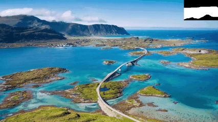</td>
    <td>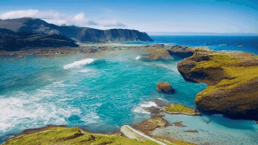</td>
    <td>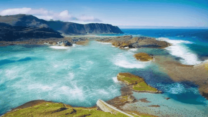</td>
    </tr>
    <tr>
    <td> Orginal </td>
    <td> The ocean, the waves ...  </td>
    <td> The ocean, the waves ...  </td>
    </tr>
    
</table>

<table>
    <tr>
    <td>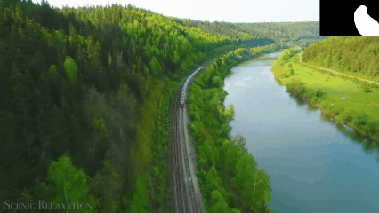</td>
    <td>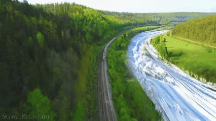</td>
    <td>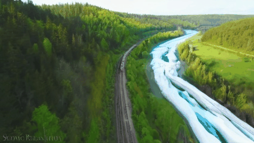</td>
    </tr>
    <tr>
    <td> Orginal </td>
    <td> The river with ice ...  </td>
    <td> The river with ice ...  </td>
    </tr>
</table>

<table>
    <tr>
    <td>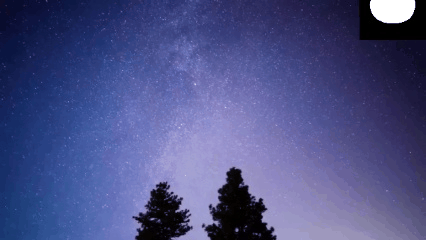</td>
    <td>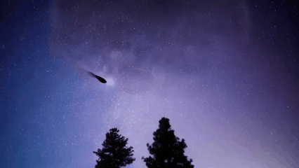</td>
    <td>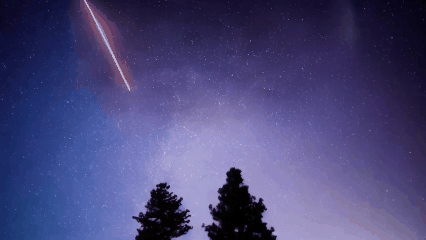</td>
    </tr>
    <tr>
    <td> Orginal </td>
    <td> Meteor streaking in the sky ...  </td>
    <td> Meteor streaking in the sky ...  </td>
    </tr>
</table>

## Table of Contents <!-- omit in toc -->
- [Features](#Features)
- [Installation](#Installation)
- [Usage](#Usage)
  - [Download pretrained models](#1-download-pretrained-models)
  - [Mask Preparation](#2-prepare-the-mask)
    - [Video-Inpaint-Anything](#5-cococo-inference-with-sam2)
  - [Inference CoCoCo](#3-run-our-validation-script)
  - [Personalized Video Inpainting](#4-personalized-video-inpainting-optional)
    - [Convert Safetensors to Pytorch weights](convert-safetensors-to-pytorch-weights)
    - [Transform Personalized Image Inpainting](take-pytorch-weights-and-add-them-on-cococo-to-create-personalized-video-inpainting)
    - [Create Personalized Inpainting Visual Content](take-pytorch-weights-and-add-them-on-cococo-to-create-personalized-video-inpainting)
  - [Inference with SAM2 (Video Inpaint Anything)](#5-cococo-inference-with-sam2)
- [TODO](#to-do)
- [Citation](#citation)
- [Acknowledgement](#acknowledgement)


### Features

* Consistent text-guided video inpainting
  * By using damped attention, we have decent inpainting visual content
* Higher text controlability
  * We have better text controlability
* Personalized video inpainting
  * We develop a training-free method to implement personalized video inpainting by leveraging personalized T2Is
* Gradio Demo using SAM2
  * We use SAM2 to create Video Inpaint Anything
* Infinite Video Inpainting
  * By using the slidding window, you are allowed to inpaint any length videos.
* Controlable Video Inpainting
  * By composing with the controlnet, we find that we can inpaint controlable content in the given masked region
* More inpainting tricks will be released soon...

### Installation

#### Step1. Installation Checklist
*Before install the dependencies, you should check the following requirements to overcome the installation failure.*
- [x] You have a GPU with at least 24G GPU memory.
- [x] Your CUDA with nvcc version is greater than 12.0.
- [x] Your Pytorch version is greater than 2.4.
- [x] Your gcc version is greater than 9.4.
- [x] Your diffusers version is 0.11.1.
- [x] Your gradio version is 3.40.0.

#### Step2. Install the requirements
*If you update your enviroments successfully, then try to install the dependencies by pip.*

  ```shell
  # Install the CoCoCo dependencies
  pip3 install -r requirements.txt
  ```

  ```shell
  # Compile the SAM2
  pip3 install -e .
  ```

*If everything goes well, I think you can turn to the next steps.*

## Usage
### 1. Download pretrained models. 

***Note that our method requires both parameters of SD1.5 inpainting and cococo.***

   * **The pretrained image inpainting model ([Stable Diffusion Inpainting](https://huggingface.co/benjamin-paine/stable-diffusion-v1-5-inpainting).)**

   * **The CoCoCo [Checkpoints](https://mycuhk-my.sharepoint.com/:f:/g/personal/1155203591_link_cuhk_edu_hk/EoXyViqDi8JEgBDCbxsyPY8BCg7YtkOy73SbBY-3WcQ72w?e=cDZuXM).**

* *Warning: the runwayml delete their models and weights, so we must download the image inpainting model from other url.*

* *After download, you should put these two models in two folders, the image inpainting folder should contains scheduler, tokenizer, text_encoder, vae, unet, the cococo folder should contain model_0.pth to model-3.pth*

### 2. Prepare the mask

**~~You can obtain mask by [GroundingDINO](https://github.com/IDEA-Research/GroundingDINO) or [Track-Anything](https://github.com/gaomingqi/Track-Anything), or draw masks by yourself.~~**

**We release the gradio demo to use the SAM2 to implement Video Inpainting Anything. Try our [Demo](https://github.com/zibojia/COCOCO?tab=readme-ov-file#5-cococo-inference-with-sam2)!**

<p align="center">
  
</p>


### 3. Run our validation script.

**By running this code, you can simply get the video inpainting results.**

  ```python
  python3 valid_code_release.py --config ./configs/code_release.yaml \
  --prompt "Trees. Snow mountains. best quality." \
  --negative_prompt "worst quality. bad quality." \
  --guidance_scale 10 \ # the cfg number, higher means more powerful text controlability
  --video_path ./images/ \ # the path that store the video and masks, the format is the images.npy and masks.npy
  --model_path [cococo_folder_name] \ # the path to cococo weights, e.g. ./cococo_weights
  --pretrain_model_path [sd_folder_name] \ # the path that store the pretrained stable inpainting model, e.g. ./stable-diffusion-v1-5-inpainting
  --sub_folder unet # set the subfolder of pretrained stable inpainting model to get the unet checkpoints
  ```

### 4. Personalized Video Inpainting (Optional)

*We give a method to allow users to compose their own personlized video inpainting model by using personalized T2Is* **WITHOUT TRAINING**. There are three steps in total:

* Convert the opensource model to Pytorch weights.
  
* Transform the personalized image diffusion to personliazed inpainting diffusion. Substract the weights of personalized image diffusion from SD1.5, and add them on inpainting model. Surprisingly, this method can get a personalized image inpainting model, and it works well:)
   
* Add the weight of personalized inpainting model to our CoCoCo.

<table>
    <tr>
    <td></td>
    <td>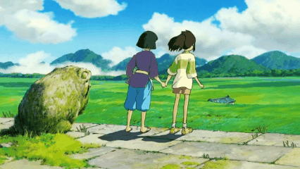</td>
    <td>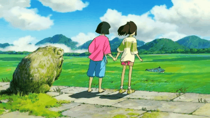</td>
    </tr>
</table>

<table>
    <tr>
    <td>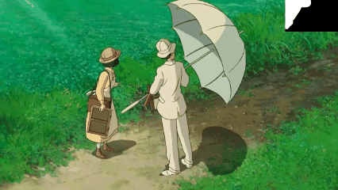</td>
    <td>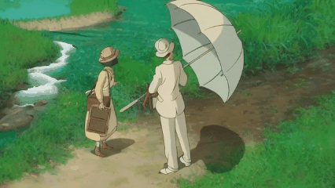</td>
    <td>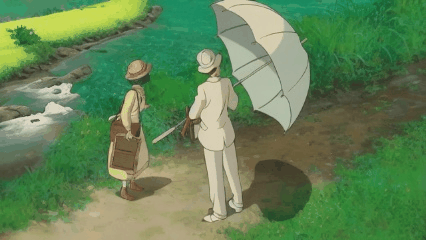</td>
    </tr>
</table>

<table>
    <tr>
    <td>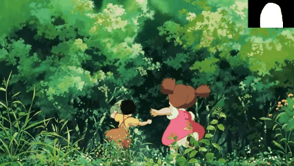</td>
    <td>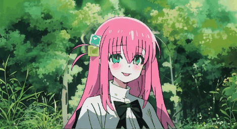</td>
    <td>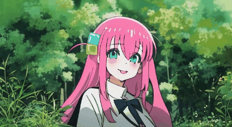</td>
    </tr>
</table>

#### Convert safetensors to Pytorch weights

* **For the model using different key, we use the following script to process opensource T2I model.**

  For example, the [epiCRealism](https://civitai.com/models/25694?modelVersionId=134065), it is different from the key of the StableDiffusion.

  ```
  model.diffusion_model.input_blocks.1.1.norm.bias
  model.diffusion_model.input_blocks.1.1.norm.weight
  ```

  Therefore, we develope a tool to convert this type model to the delta of weight.

  ```python
  cd task_vector;
  python3 convert.py \
    --tensor_path [safetensor_path] \ # set the safetensor path
    --unet_path [unet_path] \ # set the path to SD1.5 unet weights, e.g. stable-diffusion-v1-5-inpainting/unet/diffusion_pytorch_model.bin
    --text_encoder_path [text_encoder_path] \ # set the text encoder path, e.g. stable-diffusion-v1-5-inpainting/text_encoder/pytorch_model.bin
    --vae_path [vae_path] \ # set the vae path, e.g. stable-diffusion-v1-5-inpainting/vae/diffusion_pytorch_model.bin
    --source_path ./resources \ # the path you put some preliminary files, e.g. ./resources
    --target_path ./resources \ # the path you put some preliminary files, e.g. ./resources
    --target_prefix [prefix]; # set the converted filename prefix
  ```

* **For the model using same key and trained by LoRA.**

  For example, the [Ghibli](https://civitai.com/models/54233/ghiblibackground) LoRA.

  ```
  lora_unet_up_blocks_3_resnets_0_conv1.lora_down.weight
  lora_unet_up_blocks_3_resnets_0_conv1.lora_up.weight
  ```

  ```python
  python3 convert_lora.py \
    --tensor_path [tensor_path] \ # the safetensor path
    --unet_path [unet_path] \ # set the path to SD1.5 unet weights, e.g. stable-diffusion-v1-5-inpainting/unet/diffusion_pytorch_model.bin 
    --text_encoder_path [text_encoder_path] \ # set the text encoder path, e.g. stable-diffusion-v1-5-inpainting/text_encoder/pytorch_model.bin
    --vae_path [vae_path] \ # set the vae path, e.g. stable-diffusion-v1-5-inpainting/vae/diffusion_pytorch_model.bin
    --regulation_path ./lora.json \ # use this path defaultly. Please don't change
    --target_prefix [target_prefix] # et the converted filename prefix
  ```

#### Take Pytorch weights and add them on CoCoCo to create personalized video inpainting

* **You can use customized T2I or LoRA to create vision content in the masks.**

  ```python
  python3 valid_code_release_with_T2I_LoRA.py \
  --config ./configs/code_release.yaml --guidance_scale 10 \ # set this as default
  --video_path ./images \ # the path that store the videos, the format is the images.npy
  --masks_path ./images \ # the path that store the masks, the format is the masks.npy
  --model_path [model_path] \ # the path that store the cococo weights
  --pretrain_model_path [pretrain_model_path] \ # the path that store the SD1.5 Inpainting, e.g. ./stable-diffusion-v1-5-inpainting
  --sub_folder unet \  # set the subfolder of pretrained stable inpainting model to get the unet checkpoints
  --unet_lora_path [unet_lora_path] \ #  the LoRA weights for unet
  --beta_unet 0.75 \ # the hyper-parameter $beta$ for unet LoRA weights
  --text_lora_path [text_lora_path] \ #  the LoRA weights for text_encoder
  --beta_text 0.75 \ # the hyper-parameter $beta$ for text encoder LoRA weights
  --vae_lora_path [text_lora_path] \ #  the LoRA weights for vae
  --beta_vae 0.75 \ # the hyper-parameter $beta$ for vae LoRA weights
  --unet_model_path [unet_model_path] \ # set the path to SD1.5 unet weights, e.g. stable-diffusion-v1-5-inpainting/unet/diffusion_pytorch_model.bin 
  --text_model_path [text_model_path] \ # set the text encoder path, e.g. stable-diffusion-v1-5-inpainting/text_encoder/pytorch_model.bin
  --vae_model_path [vae_model_path] \ # set the vae path, e.g. stable-diffusion-v1-5-inpainting/vae/diffusion_pytorch_model.bin
  --prompt [prompt] \
  --negative_prompt [negative_prompt]
  ```

### 5. COCOCO INFERENCE with SAM2


* **Try our demo with original COCOCO**
  ```
  CUDA_VISIBLE_DEVICES=0,1 python3 app.py \
  --config ./configs/code_release.yaml \
  --model_path [model_path] \ # the path to cococo weights
  --pretrain_model_path [pretrain_model_path] \ # the image inpainting pretrained model path, e.g. ./stable-diffusion-v1-5-inpainting
  --sub_folder [sub_folder] # set unet as default
  ```

* **Try our demo with LoRA and checkpoint**
  * By using our convertion code, we obtain some personalized image inpainting models and LoRAs, you can download from the bellow:

    * The personalized image inpainting models is [available](https://mycuhk-my.sharepoint.com/:f:/g/personal/1155203591_link_cuhk_edu_hk/EpuCr0azYKxJg7QJ71Mln9UBYDLzoFm6GQWYN9UwCauhYg?e=rwPAhY).

    * The personalized image inpainting LoRA is [available](https://mycuhk-my.sharepoint.com/:f:/g/personal/1155203591_link_cuhk_edu_hk/EiqYrc8lKUhFkpEb-DC8CV8BJPbqkJsyvz66cjXOCnDS1Q?e=hAgbi9).

  * Run the Gradio demo with LoRA.

    ```python
    CUDA_VISIBLE_DEVICES=0,1 python3 app_with_T2I_LoRA.py \
      --config ./configs/code_release.yaml \
      --unet_lora_path [unet_lora_path] \  #  the LoRA weights for unet
      --text_lora_path [text_lora_path] \ #  the LoRA weights for text_encoder
      --vae_lora_path [vae_lora_path] \  #  the LoRA weights for vae
      --beta_unet 0.75 \ # the hyper-parameter $beta$ for unet LoRA weights
      --beta_text 0.75 \ # the hyper-parameter $beta$ for text_encoder LoRA weights
      --beta_vae 0.75 \ # the hyper-parameter $beta$ for vae LoRA weights
      --text_model_path [text_model_path] \ # set the text encoder path, e.g. stable-diffusion-v1-5-inpainting/text_encoder/pytorch_model.bin
      --unet_model_path [unet_model_path] \ # set the path to SD1.5 unet weights, e.g. stable-diffusion-v1-5-inpainting/unet/diffusion_pytorch_model.bin 
      --vae_model_path [vae_model_path]  \ # set the vae path, e.g. stable-diffusion-v1-5-inpainting/vae/diffusion_pytorch_model.bin
      --model_path [model_path] \ # cococo weights
      --pretrain_model_path [pretrain_model_path] \ # the image inpainting pretrained model path, e.g. ./stable-diffusion-v1-5-inpainting
      --sub_folder [sub_folder] # the default is unet
    ```

### TO DO

---------------------------------------

[1]. *We will use larger dataset with high-quality videos to produce a more powerful video inpainting model soon.*


[2]. *The training code is under preparation.*


### Citation

---------------------------------------

```bibtex
@article{Zi2024CoCoCo,
  title={CoCoCo: Improving Text-Guided Video Inpainting for Better Consistency, Controllability and Compatibility},
  author={Bojia Zi and Shihao Zhao and Xianbiao Qi and Jianan Wang and Yukai Shi and Qianyu Chen and Bin Liang and Kam-Fai Wong and Lei Zhang},
  journal={ArXiv},
  year={2024},
  volume={abs/2403.12035},
  url={https://arxiv.org/abs/2403.12035}
}
```

### Acknowledgement
This code is based on [AnimateDiff](https://github.com/guoyww/AnimateDiff), [Segment-Anything-2](https://github.com/facebookresearch/segment-anything-2) and [propainter](https://github.com/sczhou/ProPainter).


